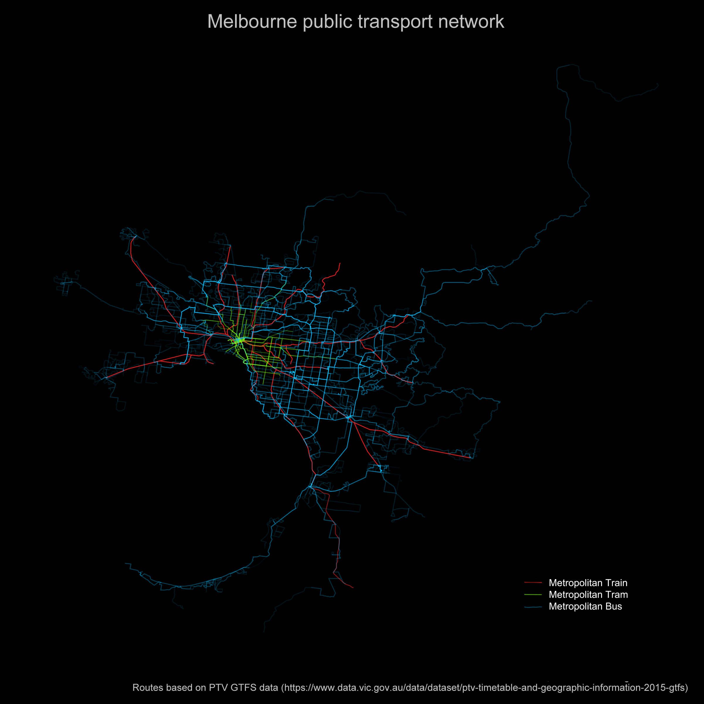

Exploring public trasnit data for Melbourne
---------

GTFS data obtained under Creative Commons Attribution 3.0 Australia licence from https://www.data.vic.gov.au/data/dataset/ptv-timetable-and-geographic-information-2015-gtfs

The data are divided in folders according to the following categories.

|  Folder  | Category                   |
|----|--------------------|
| 1  | Regional Train     |
| 2  | Metropolitan Train |
| 3  | Metropolitan Tram  |
| 4  | Metropolitan Bus   |
| 5  | Regional Coach     |
| 6  | Regional Bus       |
| 7  | TeleBus            |
| 8  | NightRider         |
| 10 | Interstate         |
| 11 | SkyBus             |

1. Transit routes
----------
Mapping all transit routes.
... 

Mapping the Metropolitan train, tram and bus lines. **Note:** this may not be a true representation of the route density as I have not taken into account the route exceptions and weekend/holiday timetables.

2. Interactive maps
----------
...